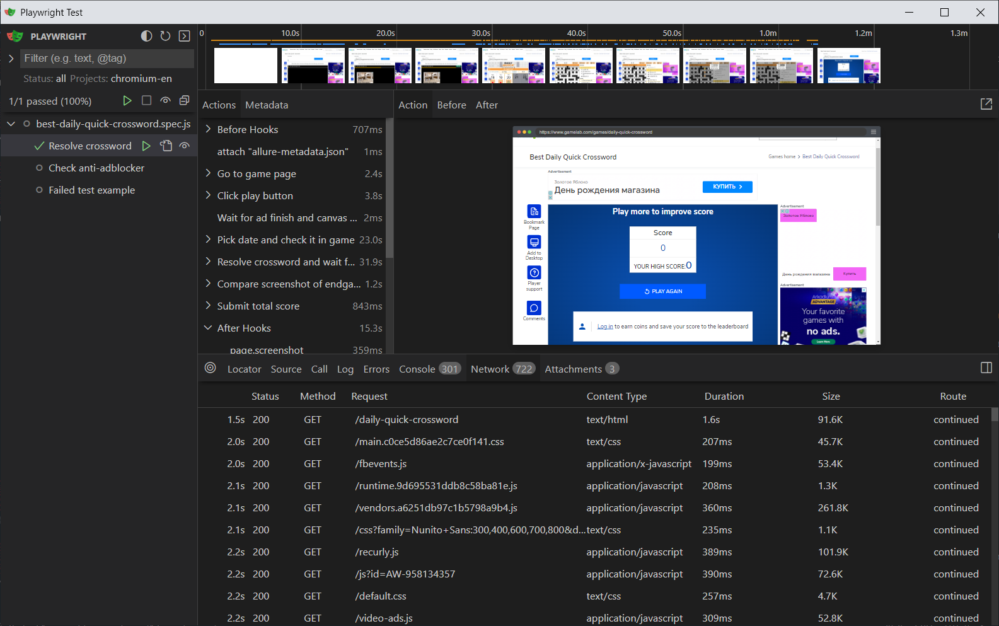

# Arkadium technical test

# Local run
Requirements:

Node.js 18

Allure reporter installed on your operating system for report

Before running the tests, make sure to install the dependencies:

```
npm install
```
To run the tests with the generation of an Allure report, use the following command:
```
npm run test
npm run report
```
or
```
npx playwright test
allure generate .
allure serve
```
Also you can ran tests in ui mode for debugging:
```
npx playwright test --ui
```

Note that 1 test fails intentionally, for demonstration purposes:)

If you are using Windows, run the commands in Git Bash.

# Docker run

Requirements:

Docker


To run the tests with Docker use the command:
```
docker run  --rm -v ${pwd}:/app osachi/arkadium npx playwright test
```
The same way you can generate report if you have Nodejs and Allure:
```
npm run report
```
# CI run
Tests can be run on GitHub Actions. Go to the repository. Open the Actions tab, select Run Test Workflow and run it (https://github.com/RomanOsadchi/arkadium_demo/actions/workflows/arcadium.yml), but you need launch permissions, which will be provided you.

The test run will start and you will be able to watch it progress on the allure testops here:
https://yuri.testops.cloud/project/1/launches.
Then you can see the result of the run. Credentials for allure testops will be provided you upon your request.
